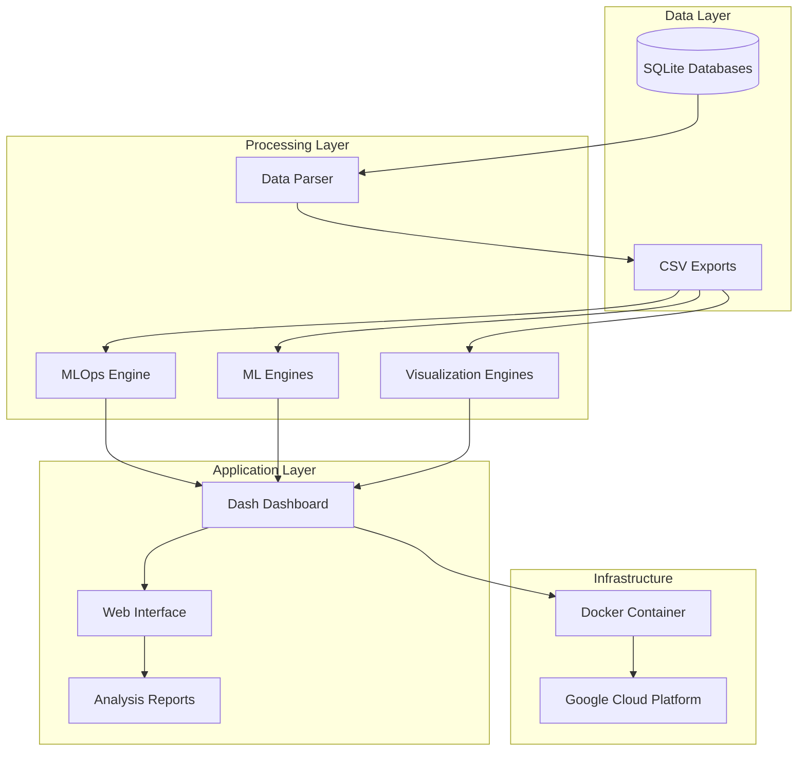

# 🔌 Power AI - Advanced Power System Analytics Platform


> **Advanced MLOps-powered platform for comprehensive power system monitoring, analysis, and predictive maintenance.**

## 🌟 Overview

Power AI is a state-of-the-art analytics platform designed for power system monitoring and optimization. It combines advanced machine learning techniques with real-time dashboard capabilities to provide comprehensive insights into electrical infrastructure performance.

### Key Features

- 🤖 **Advanced MLOps Pipeline** - Automated feature engineering, correlation analysis, and hyperparameter optimization
- 📊 **Interactive Dashboard** - Real-time monitoring with Dash/Plotly visualizations
- ⚡ **Power Quality Analysis** - Voltage stability, frequency analysis, and harmonic detection
- 🔮 **Predictive Analytics** - XGBoost-powered forecasting with anomaly detection
- 📄 **Comprehensive PDF Reports** - Professional PDF reports with detailed analysis, charts, and recommendations
- 🏗️ **Cloud-Native Architecture** - Docker containerized with GCP deployment ready
- 📈 **Automated Analysis** - Complete analysis pipeline with one-click report generation

## 🏗️ Architecture



## 🚀 Quick Start

### Prerequisites

- Python 3.11+
- Docker (for containerized deployment)
- GCP Account (for cloud deployment)

### Installation

1. **Clone the repository:**
```bash
git clone <repository-url>
cd power-ai
```

2. **Install dependencies:**
```bash
pip install -r requirements.txt
```

3. **Prepare your data:**
   - Place SQLite database files (`leituras*.db`) in the `data/` directory
   - Run the parser to convert to CSV format:
```bash
python main.py
```

4. **Launch the dashboard:**
```bash
python main_app.py
# or use the orchestrator
python run_power_ai.py
```

5. **Access the dashboard:**
   - Open your browser to `http://localhost:8050`
   - Upload additional CSV files via the web interface

## 📊 System Components

### Core Modules

#### 1. Data Processing
- **`parsing/parser.py`** - SQLite to CSV conversion with table extraction
- **`main.py`** - Entry point for data parsing operations

#### 2. Machine Learning Engines

- **`tools/mlops_advanced_engine.py`** - Advanced MLOps pipeline with:
  - Correlation analysis and feature removal
  - Multi-method feature selection (RFE, SelectKBest, SelectFromModel)
  - Hyperparameter optimization with GridSearch/RandomSearch
  - Time series cross-validation
  - Comprehensive model evaluation

- **`tools/advanced_ml_engine.py`** - Sophisticated electrical engineering features:
  - Power quality metrics calculation
  - Voltage/current imbalance detection
  - Time series lag features
  - Advanced anomaly detection

- **`tools/ml_engine.py`** - Core ML functionality:
  - Consumption forecasting
  - Anomaly detection
  - System optimization recommendations

#### 3. Visualization Systems

- **`tools/dash_frontend.py`** - Interactive web dashboard with:
  - Real-time monitoring gauges
  - ML prediction visualizations
  - Power quality analysis
  - Historical trend analysis
  - Anomaly detection interface

- **`tools/advanced_visualizations.py`** - Specialized power system visualizations:
  - Power quality dashboards
  - Electrical analysis plots
  - PDU monitoring displays

- **`tools/interactive_viz.py`** - Interactive Plotly visualizations:
  - 3D power analysis
  - Time series sliders
  - Real-time gauge displays

#### 4. Analysis Tools

- **`tools/power_analysis.py`** - Power system analysis:
  - UPS performance evaluation
  - Power quality assessment
  - Energy consumption analysis
  - Executive reporting

- **`tools/exploration_summary.py`** - Data exploration and summary generation
- **`tools/quick_explore.py`** - Rapid data overview capabilities

#### 5. Utilities

- **`tools/additional_utilities.py`** - Supporting utilities:
  - Configuration management
  - Data quality checks
  - Alert systems
  - Performance monitoring

#### 6. PDF Reporting System

- **`tools/pdf_report_generator.py`** - Comprehensive PDF report generator:
  - Executive summary with key findings
  - System overview and performance metrics
  - Detailed power analysis with time series plots
  - Data quality assessment and recommendations
  - Professional formatting with charts and visualizations

- **`tools/comprehensive_analysis.py`** - Complete analysis pipeline:
  - Orchestrates all analysis engines
  - Generates comprehensive PDF reports
  - Progress tracking and error handling
  - Performance timing and success metrics

### Application Entry Points

- **`main_app.py`** - Production dashboard server (Docker/GCP ready)
- **`power_ai.py`** - Complete system orchestrator with interactive menu
- **`run_power_ai.py`** - Advanced system controller for ML and visualization workflows

## 🔧 Configuration

### Data Sources Supported

- **UPS Systems**: Voltage, current, power, load, frequency data
- **Energy Meters**: Primary and secondary consumption metrics
- **Power Distribution Units (PDUs)**: 8-channel monitoring
- **Battery Systems**: Health and performance monitoring
- **Environmental Sensors**: Temperature, humidity data

### ML Features

The system automatically generates 50+ electrical engineering features including:
- Power calculations (total, imbalance, power factor)
- Voltage/current stability metrics
- Frequency analysis and harmonics
- Time-based cyclical features
- Rolling statistical measures
- Lag features for time series modeling

## 🌐 Deployment Options

### Local Development
```bash
python main_app.py
```

### Docker Deployment
```bash
docker build -t power-ai .
docker run -p 8080:8080 power-ai
```

### Google Cloud Platform
```bash
# Authenticate with GCP
gcloud auth login

# Deploy using provided script
./deploy.sh
```

**GCP Configuration:**
- **Runtime**: Python 3.11
- **Instance**: F2 (1 CPU, 2GB RAM)
- **Scaling**: 1-10 instances with auto-scaling
- **Region**: Configurable (default: us-central1)

## 📈 Outputs and Reports

### Generated Artifacts

```
outputs/
├── csv_data/           # Parsed database tables
├── exploration/        # Data exploration reports
├── ml_models/          # Trained ML models
├── mlops_models/       # MLOps optimized models
├── mlops_analysis/     # Comprehensive ML reports
├── power_analysis/     # Power system dashboards
├── advanced_viz/       # Advanced visualizations
├── interactive_viz/    # Interactive plots
├── ml_viz/            # ML performance visualizations
├── reports/           # Generated PDF reports
└── logs/              # System logs
```

### Report Types

1. **PDF Comprehensive Reports** - Professional multi-page reports with:
   - Executive summary with key findings and alerts
   - System overview with performance dashboards
   - Detailed power analysis with time series plots
   - Data quality assessment and metrics
   - Actionable recommendations and priorities

2. **Executive Summaries** - High-level system performance overview
3. **Technical Reports** - Detailed power quality analysis
4. **ML Performance** - Model accuracy and feature importance
5. **Anomaly Reports** - Detected system irregularities
6. **Optimization Recommendations** - System improvement suggestions

## 🛠️ Development

### Testing
```bash
# Run integration tests
python test_integration.py

# Test dynamic predictions
python test_dynamic_predictions.py
```

### Code Structure

```
power-ai/
├── parsing/              # Data parsing utilities
├── tools/               # Core analysis engines
├── notebooks/           # Jupyter analysis notebooks
├── outputs/            # Generated results
├── data/               # Source database files
├── requirements.txt    # Python dependencies
├── Dockerfile         # Container configuration
├── app.yaml          # GCP App Engine config
├── cloudbuild.yaml   # GCP Cloud Build config
└── deploy.sh         # Deployment automation
```

## 📋 Usage Examples

### 1. Complete System Analysis
```bash
python power_ai.py
# Select option 7: "Run All Analyses"
```

### 2. Real-time Dashboard
```bash
python main_app.py
# Navigate to http://localhost:8050
```

### 3. Advanced MLOps Pipeline
```bash
python run_power_ai.py
# Select option 3: "Run MLOps ADVANCED Analysis"
```

### 4. Generate PDF Reports
```bash
# Via Dashboard - Click "📊 Generate Report" button
python main_app.py

# Via Command Line
python tools/pdf_report_generator.py

# Comprehensive Analysis with PDF Report
python tools/comprehensive_analysis.py
```

### 5. Custom Analysis
```python
from tools.mlops_advanced_engine import MLOpsAdvancedEngine

engine = MLOpsAdvancedEngine()
datasets = engine.load_data()
results = engine.train_optimized_model(datasets['your_dataset'])
```

## 🔍 Features Deep Dive

### MLOps Pipeline
- **Feature Correlation Analysis**: Removes highly correlated features (>95% correlation)
- **Feature Selection**: Uses RFE, SelectKBest, and SelectFromModel
- **Hyperparameter Optimization**: GridSearch and RandomizedSearch
- **Cross-Validation**: Time series splits for temporal data
- **Model Persistence**: Automatic model saving and loading

### Power Quality Metrics
- **Voltage Stability**: RMS calculations and variation analysis
- **Current Imbalance**: Three-phase balance assessment
- **Power Factor Analysis**: Real vs. reactive power evaluation
- **Harmonic Detection**: Frequency domain analysis
- **Load Forecasting**: XGBoost-based consumption prediction

### Dashboard Features
- **Real-time Monitoring**: Live gauge displays with auto-refresh
- **Interactive Charts**: Plotly-powered visualizations with zoom/pan
- **Data Upload**: Drag-and-drop CSV file support
- **Multi-dataset Analysis**: Compare multiple time periods
- **Export Capabilities**: Download reports and visualizations

## 🚨 Troubleshooting

### Common Issues

1. **Data Loading Errors**
   - Ensure database files are in `data/` directory
   - Check file permissions and formats
   - Run parser first: `python main.py`

2. **Memory Issues**
   - Use sample_size parameter to limit data
   - Monitor system resources during analysis
   - Consider increasing Docker memory limits

3. **Deployment Issues**
   - Verify GCP authentication: `gcloud auth list`
   - Check project permissions and API enablement
   - Review logs: `gcloud logs read power-ai`

### Performance Optimization
- Use data sampling for large datasets
- Enable compression for data storage
- Implement caching for repeated analyses
- Monitor memory usage during ML training

## 🤝 Contributing

1. Fork the repository
2. Create a feature branch
3. Implement your changes
4. Add tests and documentation
5. Submit a pull request

## 📄 License

This project is licensed under the MIT License - see the LICENSE file for details.

## 🙏 Acknowledgments

- Built with Dash, Plotly, and scikit-learn
- Powered by XGBoost for advanced ML capabilities
- Designed for electrical engineering applications
- Optimized for cloud-native deployment

---

**Power AI** - Transforming power system monitoring through advanced analytics and machine learning.

For questions or support, please open an issue or contact the development team.
